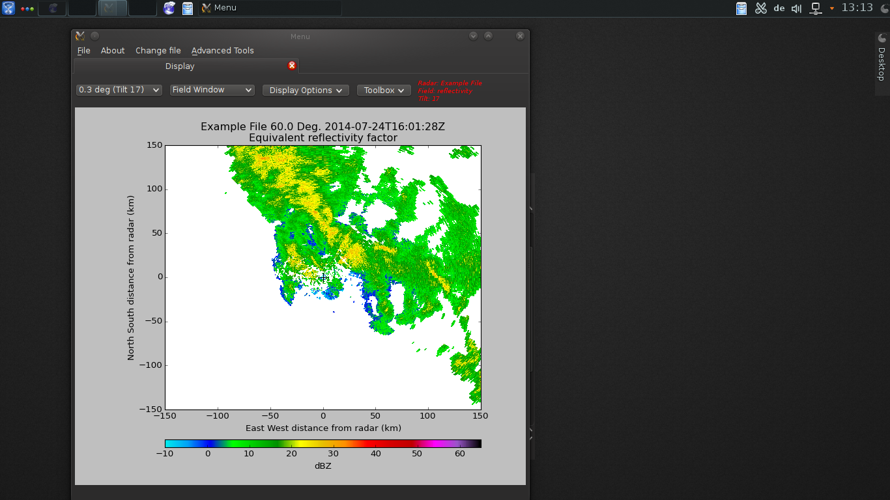
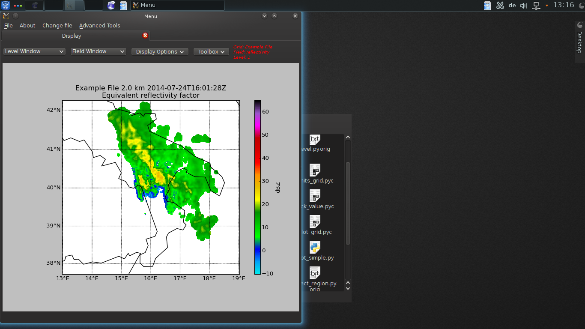
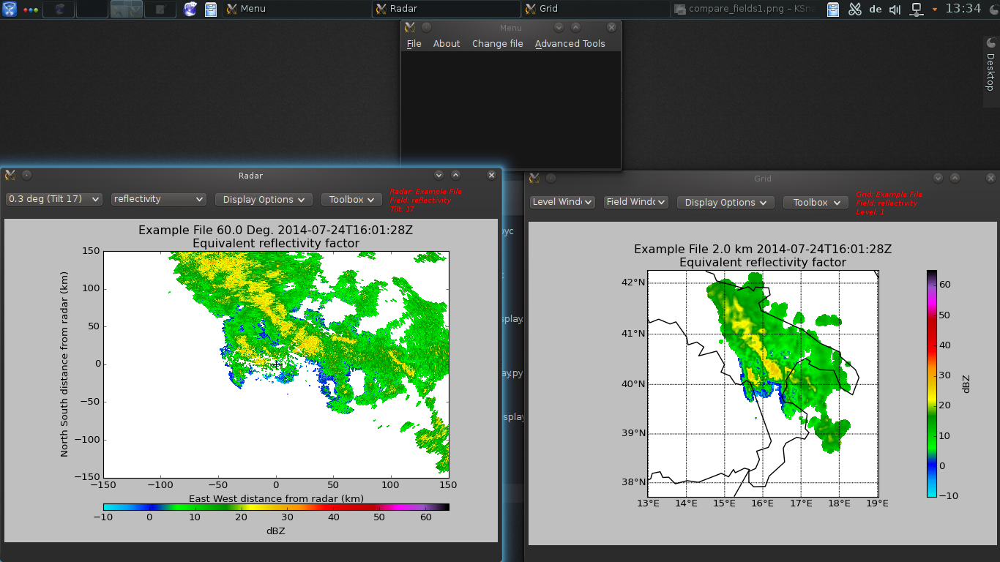
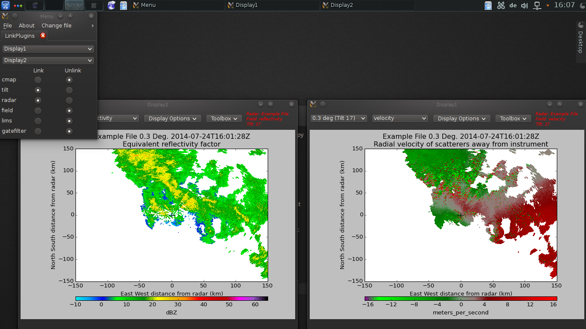
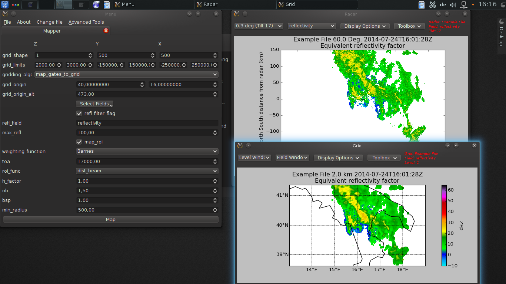
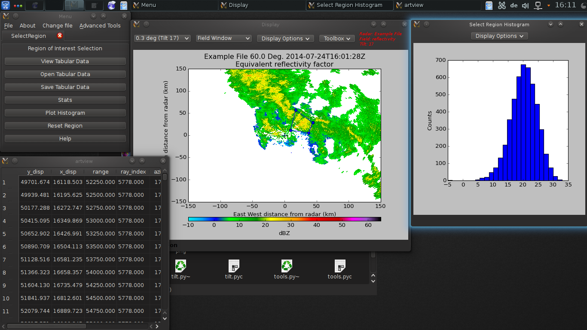
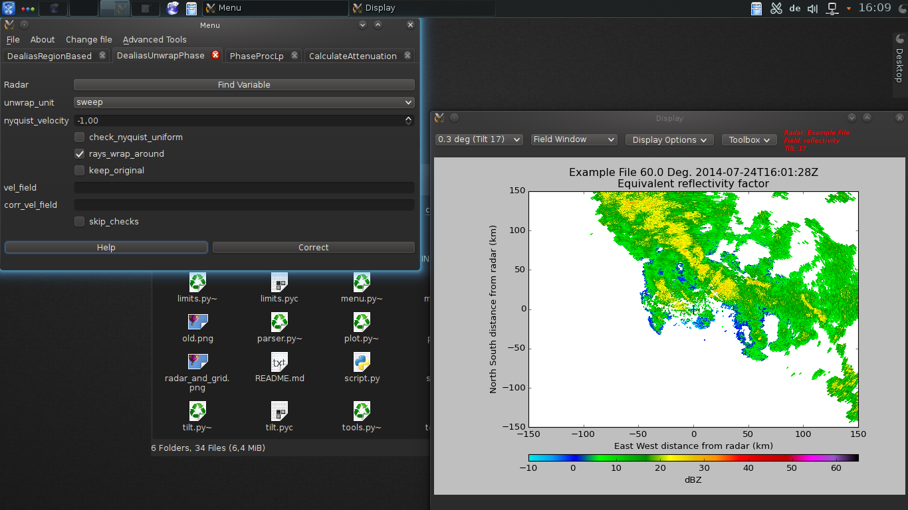
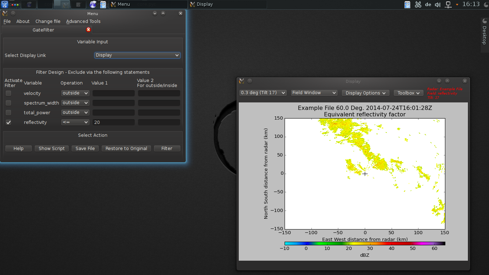

SCRIPTS
=======

Here is a list of the predefined scripts that are accessible with the -s command line option.

## radar

Open a radar file and visualize it.

## grid

Open a grid file and visualize it.

## radar_and_grid

Open a radar and/or a grid file for visualization.

## compare_fields

Use to compare side to side two fields of a radar file.

## map_to_grid

Open a radar file and map it to a grid object.

## select_region

Select a region on a radar display and get statistics over it.

## corrections

Perform corrections and other calculation in a radar file.

## gatefilter

Filter gates of radar file.

